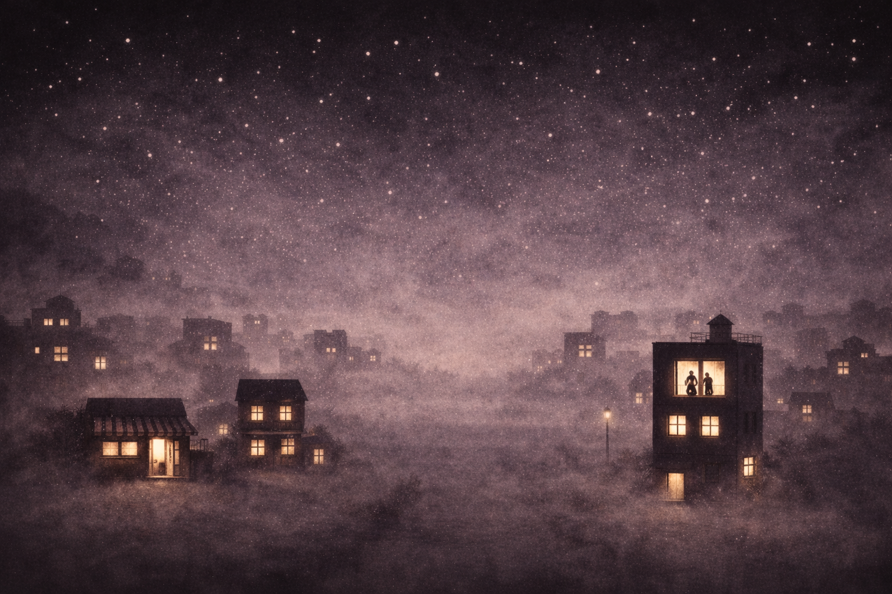
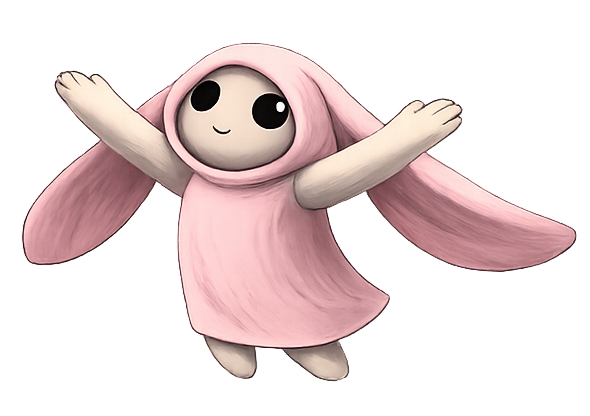
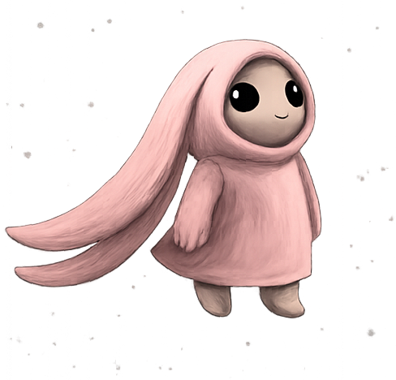
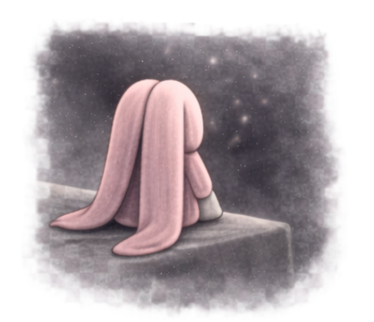

# Ciudad Vacía 🌃

<div align="center">
  
  
  **Una experiencia interactiva inspirada en Chobits**
  
  
  
  
</div>

---

## ⚠️ CRÉDITOS - PROPIEDAD INTELECTUAL

<div align="center">

### 🎨 **CHOBITS (ちょびっツ)** es propiedad de **CLAMP (クランプ)**

**Creadoras:**
- **Nanase Ohkawa** (大川 七瀬) - Historia y guión
- **Mokona** (もこな) - Diseño de personajes
- **Tsubaki Nekoi** (猫井 椿) - Arte
- **Satsuki Igarashi** (いがらし 寒月) - Fondos

**© CLAMP / Kodansha / Madhouse**

📅 **Manga:** 2000-2002 | **Anime:** 2002

---

**TODOS LOS DERECHOS DE CHOBITS PERTENECEN A SUS CREADORES.**

Este proyecto es una **obra derivada sin fines de lucro**.  
No está afiliado, respaldado ni patrocinado por CLAMP o sus licenciatarios.

</div>

---

## 📖 Sobre el Proyecto

**Ciudad Vacía** es un proyecto que explora el concepto de **"La ciudad donde no vive nadie"** de Chobits a través de una historia interactiva con sistema drag & drop.

Una reflexión sobre la soledad, la tecnología y la conexión humana, inspirada en la obra maestra de CLAMP.

---

## 🎨 Assets Visuales

<div align="center">

### Fondos Atmosféricos


<<<<<<< HEAD
=======

>>>>>>> 3d2e270646f0ab972a8ee574fe3a891410810905
### Watash Sprites





*Assets originales inspirados en el estilo visual de Chobits*

</div>

---

## ✨ Características

- 🎮 Sistema Drag & Drop nativo (HTML5)
- 📖 4 capítulos narrativos progresivos
- 🎨 Estética "ciudad vacía" minimalista
- 🖼️ Fondos dinámicos por capítulo
- 💾 Gestión de estado con Pinia
- 🌙 Diseño glassmorphism

---

## 🛠️ Tecnologías

- **Vue 3** - Composition API
- **Vite** - Build tool
- **Tailwind CSS v4** - Styling
- **Pinia** - State management
- **Vue Router** - SPA routing

---

## 🚀 Instalación
<<<<<<< HEAD

```bash
# Clonar repositorio
git clone https://github.com/tu-usuario/chobits-adventure.git
cd chobits-adventure
=======
```bash
# Clonar repositorio
git clone https://github.com/tu-usuario/ciudad-vacia.git
cd ciudad-vacia
>>>>>>> 3d2e270646f0ab972a8ee574fe3a891410810905

# Instalar dependencias
pnpm install

# Ejecutar en desarrollo
pnpm dev

# Build para producción
pnpm build
```

---

## 📜 Licencia

### Código Fuente

**CC0 1.0 Universal (Public Domain)** - El código de este repositorio es de dominio público.

✅ Puedes usar, modificar y distribuir el código libremente.

### ⚠️ Propiedad Intelectual

**Chobits y todos sus elementos son © CLAMP.**

El nombre "Chobits", personajes, conceptos y diseños originales pertenecen a CLAMP y sus licenciatarios.

**Si usas este código:**
- Reemplaza los assets con creaciones 100% originales
- Modifica los textos para que sean completamente originales  
- No uses marcas registradas de Chobits comercialmente
- Da crédito a CLAMP como inspiración

---

## 🙏 Agradecimientos

### Inspiración Original

**CLAMP** - Por crear Chobits, una obra sobre amor, soledad y humanidad que ha inspirado a generaciones.

**"La ciudad donde no vive nadie"** - El libro de imágenes dentro de Chobits que dio origen a este concepto.

### Desarrollo

**Ruth Daniela Aguirre** - Desarrollo y diseño  

### Comunidad Open Source

Vue.js, Vite, Tailwind CSS y todas las librerías que hicieron posible este proyecto.

---

## ⚠️ Descargo de Responsabilidad

Este es un **proyecto sin ánimo de lucro**.

- ❌ No afiliado con CLAMP, Kodansha o Madhouse
- ❌ No destinado a uso comercial
- ✅ Obra transformativa con propósito educativo
- ✅ No sustituye la obra original

**Se recomienda encarecidamente leer el manga original y ver el anime de Chobits.**

Todos los derechos de Chobits pertenecen a CLAMP.

---

<div align="center">

**Hecho con 💕 inspirado en Chobits**

*"¿Hay alguien... solo para mí?"*

---

<<<<<<< HEAD
[](https://github.com/tu-usuario/chobits-adventure)
=======
[](https://github.com/tu-usuario/ciudad-vacia)
>>>>>>> 3d2e270646f0ab972a8ee574fe3a891410810905

</div>
